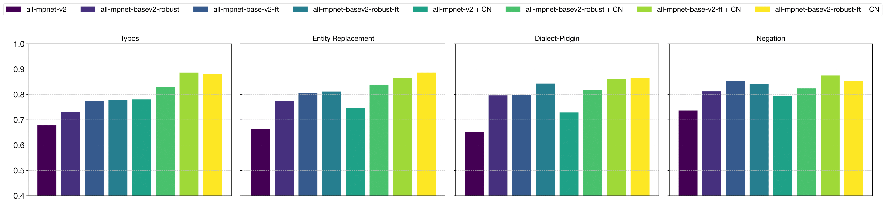

# When Claims Evolve: Evaluating and Enhancing the Robustness of Embedding Models Against Misinformation Edits 
[
](https://arxiv.org/abs/2503.03417) <a href=#bibtex></a>

[Jabez Magomere](), [Emanuele La Malfa](https://emanuelelm.github.io/), [Manuel Tonneau](https://manueltonneau.com/), [Ashkan Kazemi](https://ashkankzme.github.io/), [Scott Hale](https://www.oii.ox.ac.uk/people/profiles/scott-hale/)

This repository contains the code for the paper [*When Claims Evolve*: Evaluating and Enhancing the Robustness of Embedding Models Against Misinformation Edits](https://arxiv.org/abs/2503.03417). If you have any questions, feel free to create a Github issue or reach out to the first author at jabez.magomere@keble.ox.ac.uk. 

## Overall Description
Online misinformation remains a critical challenge, and fact-checkers increasingly rely on embedding-based methods to retrieve relevant fact-checks. Yet, when debunked claims reappear in edited forms, the performance of these methods is unclear. In this work, we introduce a taxonomy of six common real-world misinformation edits and propose a perturbation framework that generates valid, natural claim variations. Our multi-stage retrieval evaluation reveals that standard embedding models struggle with user-introduced edits, while LLM-distilled embeddings offer improved robustness at a higher computational cost. Although a strong reranker helps mitigate some issues, it cannot fully compensate for first-stage retrieval gaps. Addressing these retrieval gaps, our train- and inference-time mitigation approaches enhance in-domain robustness by up to 17 percentage points and boost out-of-domain generalization by 10 percentage points over baseline models. Overall, our findings provide practical improvements to claim-matching systems, enabling more reliable fact-checking of evolving misinformation. A visual summary of our approach is provided below:

<p align="center">
  
</p>

### Before Reranking Results on *CheckThat22* Dataset
<p align="center">
  
</p>

### After Reranking Results on *CheckThat22* Dataset

<p align="center">
  
</p>

### Mitigation Results on *CheckThat22* Dataset
<p align="center">
  
</p>

## Getting Started
- Setup python environment
- Install setup.py to project

## Getting Started
- Setup python environment
- Install setup.py to project

## Datasets
- How to obtain the dataset
- Description of all the datasets with links to repo and how to parse them to fit the current project
- Data is formatted to TREC format i.e. vclaim, query_id, description of the TREC format
- How data is loaded in the project

## Generating Misinformation Edits
- Description of Config
- Prompt 
- API key --> parsing the OpenAI api key
- Directories to create the config
 
 ### LLM As a Perturber
 - Command to generate each perturbation type
  
 ### LLM As a Verifier
 - Command to verify the generated perturbations 

## Retrievers Evaluation (Before Reranking)
- Code to call for before_reranking
- Code to call for dialct ranking
- Code implementation for BM25

## Reranker Evaluation (After Reranking)

## Mitigation
### Knowledge distillation approach + code
### Claim Normalization Approach 
### 
 
 


## Data
To load the data used in the experiments, run the script below to download the data from CLEFCheckThat22 edition.

```
chmod +x download_clef.sh
.\download_clef.sh
```

## Misinformation Edits
### Named Entity Replacements
To generate named entity replacement edits on input claims, set up the following config and specify the different parameters as shown below.

```
[data]
dataset = clef2021-checkthat-task2a--english

[model]
model_string = llama3-70b-8192
temperature = 0.9
prompt_template = "You will receive three inputs:
    1. A claim made on social media
    2. A fact-check of that claim
    3. A list of named entities (people, places, organizations, etc.) to replace in the original claim
    
    Your task is to generate a list of {number_of_samples} alternative name entities that can replace the each original one in the claim, while making sure the fact-check still applies to the modified claim
    and the modified claim is grammatically correct. 
    
    Return your output as a JSON object containing the list of swappable name entity tokens.

    Claim: {claim}
    Fact Check: {fact_check}
    Named Entity Tokens: {named_entities}

    Response format: {{
        "replaceable_entities": [
            {{
                "token": string,
                "replacements": [string]
            }}
        ]
    }}"

[generation]
number_of_samples = 3
baseline = 1
worstcase = 3

[verifier]
model_string = microsoft/deberta-v3-base
model_path = /experiments/train_verifier/debertaV3/
num_labels = 2
```

#### Usage
```
usage: generate.py [-h] [--no-baseline] [--no-worstcase] experiment_path

positional arguments:
  experiment_path  path where config lies

options:
  -h, --help       show this help message and exit
  --no-baseline    Skip generating baseline edits
  --no-worstcase   Skip generating worstcase edits
```

#### Example
To generate the rewrites;
python src/claimrobustness/name_entity_replacement/generator.py experiments/named_entity_replacement/gpt4o/ fact-check-tweet

## Bibtex
If you find our work useful, please consider citing our paper!

```bibtex
@misc{magomere2025claimsevolveevaluatingenhancing,
      title={When Claims Evolve: Evaluating and Enhancing the Robustness of Embedding Models Against Misinformation Edits}, 
      author={Jabez Magomere and Emanuele La Malfa and Manuel Tonneau and Ashkan Kazemi and Scott Hale},
      year={2025},
      eprint={2503.03417},
      archivePrefix={arXiv},
      primaryClass={cs.CL},
      url={https://arxiv.org/abs/2503.03417}, 
}
```