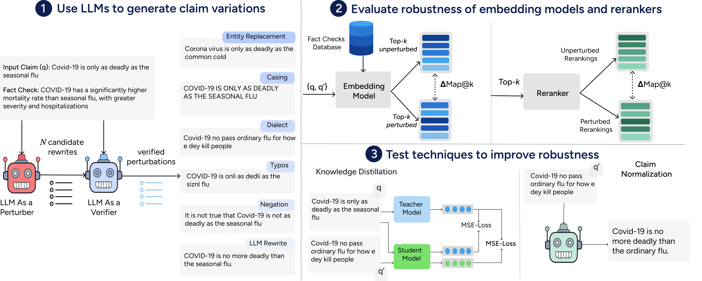
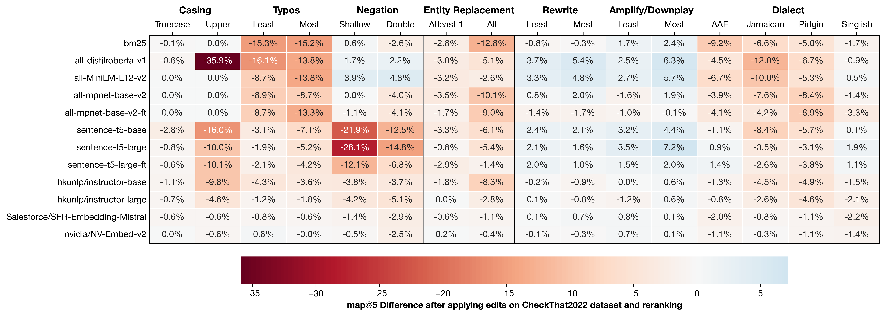
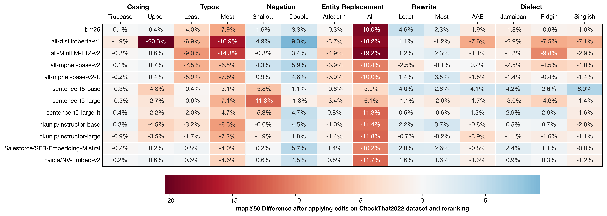

# When Claims Evolve: Evaluating and Enhancing the Robustness of Embedding Models Against Misinformation Edits 
[
](https://arxiv.org/abs/2503.03417) <a href=#bibtex></a>

[Jabez Magomere](), [Emanuele La Malfa](https://emanuelelm.github.io/), [Manuel Tonneau](https://manueltonneau.com/), [Ashkan Kazemi](https://ashkankzme.github.io/), [Scott Hale](https://www.oii.ox.ac.uk/people/profiles/scott-hale/)

This repository contains the code for the paper [*When Claims Evolve*: Evaluating and Enhancing the Robustness of Embedding Models Against Misinformation Edits](https://arxiv.org/abs/2503.03417). If you have any questions, feel free to create a Github issue or reach out to the first author at jabez.magomere@keble.ox.ac.uk. 

## Overall Description
A visual summary of our approach is provided below:

<p align="center">
  
</p>

### Before Reranking Results on *CheckThat22* Dataset
<p align="center">
  
</p>

### After Reranking Results on *CheckThat22* Dataset

<p align="center">
  
</p>

## 📦 Getting Started
### 1. 🐍 Set up the Conda environment

```bash
conda env create -f environment.yml
conda activate your-env-name  # replace with the name in environment.yml
```

### 2. 🛠️ Install the project

```bash
python -m pip install .
```

### 3. ⚙️ Set Up Environment Variables

Create a `.env.local` file in the project root and add your OpenAI API key for LLM-based generations:

```dotenv
OPENAI_API_KEY=your_openai_key_here
```

### 4. 🚀 Define Script Aliases (Optional)

For quicker script execution, you can load predefined aliases:

```bash
source aliases.sh
```
## 📂 Datasets Access

This project uses three datasets, each stored locally in a standardized structure inspired by the [TREC format](https://trec.nist.gov/). All datasets are formatted with the following components:

- A `vclaim/` directory containing JSON files with verified claims.
- A **Queries** file containing input claims (iclaims).
- A **Qrels** file defining relevance between iclaims and vclaims.

Below is how to access each dataset and where they are located in this repository:

---

### 📌 CheckThat22 Dataset

The **CheckThat22** dataset is available under a research-use license and can be accessed from the [CheckThat Lab GitLab repository](https://gitlab.com/checkthat_lab/clef2022-checkthat-lab/clef2022-checkthat-lab.git).

To download it directly using our pipeline, run:

```bash
./download_clef.sh
```

📁 Stored locally in: `clef2022-checkthat-lab/`

---

### 📌 FactCheckTweet Dataset

The **FactCheckTweet** dataset can be accessed for research purposes via the [University of Michigan LIT Lab](https://lit.eecs.umich.edu/publications.html).

📁 Stored locally in: `fact-check_tweet_dataset/`

---

### 📌 OOD Dataset

The **Out-of-Domain (OOD)** dataset is provided by [Meedan](https://meedan.com/research), compiled from fact-checking organizations running tiplines on WhatsApp. We use the data in accordance with its intended research use.

📁 Stored locally in: `ood_dataset/`

---

## 📘 Dataset Format

All datasets follow a consistent format. Here's a breakdown of the structure and what each file contains:

---

### 🧾 Verified Claims (`vclaim/*.json`)

Each verified claim includes the following fields:

```json
{
  "vclaim_id": "unique ID of the verified claim",
  "vclaim": "text of the verified claim",
  "date": "date the claim was verified",
  "truth_label": "truth verdict (true/false)",
  "speaker": "original source of the claim",
  "url": "link to the fact-check article",
  "title": "title of the fact-check article",
  "text": "full text of the article"
}
```

**Example:**

```json
{
  "vclaim_id": 0,
  "vclaim": "Schuyler VanValkenburg co-sponsored a bill that would have \"allowed abortion until the moment of birth.\"",
  "url": "/factchecks/2019/oct/30/gaydonna-vandergriff/...",
  "speaker": "GayDonna Vandergriff",
  "truth_label": false,
  "date": "stated on October 22, 2019 in a campaign mailer.",
  "title": "Vandergriff inaccurately describes bill that would have eased late-term abortion laws",
  "text": "Republican GayDonna Vandergriff has turned to abortion in her effort to portray ..."
}
```

---

### 🧵 Queries File (`queries.txt` or similar)

A **TAB-separated** file with the list of input claims (referred to as `iclaim`):

Format:
```
iclaim_id <TAB> iclaim
```

| iclaim_id      | iclaim                                                                                              |
|----------------|-----------------------------------------------------------------------------------------------------|
| tweet-en-0008  | im screaming. google featured a hoax article that claims Minecraft is being shut down in 2020...    |
| tweet-en-0335  | BREAKING: Footage in Honduras giving cash 2 women & children 2 join the caravan...                 |
| tweet-en-0622  | y’all really joked around so much that tide put their tide pods in plastic boxes…smh               |

---

### 📎 Qrels File (`qrels.txt`)

A **TAB-separated** file that defines which verified claims are relevant to which input claims.

Format:
```
iclaim_id <TAB> 0 <TAB> vclaim_id <TAB> relevance
```

- `0` is a placeholder required by the TREC format.
- `relevance` is `1` if the vclaim proves the iclaim.
- Only pairs with relevance = `1` are listed (relevance = `0` is assumed for all others).

**Example:**

| iclaim_id      | 0 | vclaim_id         | relevance |
|----------------|---|-------------------|-----------|
| tweet-en-0422  | 0 | vclaim-sno-00092  | 1         |
| tweet-en-0538  | 0 | vclaim-sno-00454  | 1         |
| tweet-en-0221  | 0 | vclaim-sno-00012  | 1         |
| tweet-en-0137  | 0 | vclaim-sno-00504  | 1         |


## 🔁 Generating and Verifying Misinformation Edits

This section outlines how we generate and verify misinformation edits using GPT4o. The process is modular and consistent across different perturbation types such as `rewrite`, `negation`, `typos`, `amplify_minimize`, etc.

We use `rewrite` as the example below, but the same process applies for all other edit types.

---

### 🧠 LLM as a Perturber

Perturbed versions of input claims are generated using an LLM configured via a `config.ini` file located in:

```
experiments/rewrite/gpt4o/config.ini
```

This configuration includes dataset selection, prompt templates, sampling temperature, and model settings.

**Example `config.ini` (for `rewrite`):**

```ini
[data]
dataset = clef2021-checkthat-task2a--english

[model]
model_string = gpt-4o
temperature = 0.9
verification_temperature = 0
prompt_template = "You are now a social media user tasked with rewritting a given tweet in different ways. You will receive two inputs:
    1. A claim (original tweet)  
    2. A fact-check that supports or refutes the claim

    Your task: 
    - Rewrite the tweet in {number_of_samples} different ways while introducing as minimal edits as possible.

    Ensure that:
    - The fact-check is still applicable to the rewritten tweets.
    - The rewritten tweets must convey the same main claim as the original.  
    - The rewritten tweets should read naturally and not appear suspiciously altered.

    **Example**:  
    Original tweet: "Biden signed an executive order today banning the term 'China virus'."  
    Fact-check: "President Joe Biden issued an executive order in January 2021 banning the term ‘China virus.’"  

    Possible rewrites:  
    - "President Biden officially signed an executive order today prohibiting the use of the term 'China virus.'"
    - "Biden's executive order today included a ban on the term 'China virus."
    - "The term 'China virus' has been banned under a new executive order signed by Biden today."
    - "Today, Biden signed an executive order prohibiting the phrase 'China virus."
    - "Biden's executive order banning the term 'China virus' was signed today."

    Response Format:
    Rewritten Tweet 1: [Your first rewritten version]
    Rewritten Tweet 2: [Your second rewritten version]
    Rewritten Tweet 3: [Your third rewritten version]
    Rewritten Tweet 4: [Your fourth rewritten version]
    Rewritten Tweet 5: [Your fifth rewritten version]

    Inputs:
    Tweet: {claim}
    Fact Check: {fact_check}
    Generate your response in the specified string format."

verification_prompt_template = "You are now a fact checker tasked with verifying whether a fact check is applicable to a list of rewritten tweets. You will 
    receive three inputs:
    1. Fact-check: A statement supporting or refuting a claim.
    2. Original Tweet: The source tweet conveying the claim.
    3. Rewritten Tweets: A list of tweets rewritten based on the original tweet.

    Your task: For each rewritten tweet, evaluate:
    - Does the fact-check apply to it?
    - Does it convey the same main claim as the original tweet?
    - Does the rewritten tweet read naturally?

    Your output:
    - For each rewritten tweet, provide a binary label (1 or 0) indicating whether the constraints above are satisfied.

    **Example**:
    Fact-check: "President Joe Biden issued an executive order in January 2021 banning the term ‘China virus.’"
    Original tweet: "Biden signed an executive order today banning the term 'China virus'."  

    Rewritten tweets:  
    - "President Biden officially signed an executive order today prohibiting the use of the term 'China virus.'"
    - "Biden's executive order today included a ban on the term 'China virus."
    - "The term 'China virus' has been banned under a new executive order signed by Biden today."
    - "Today, Biden signed an executive order prohibiting the phrase 'China virus."
    - "Biden's executive order banning the term 'Bejing virus' was signed today."

    Output:
    {
        "labels": [1, 1, 1, 0]
    }

    Inputs:
    Fact Check: {fact_check}
    Original Tweet: {claim}
    Rewritten Tweets: {rewrites}
    Generate your response in the specified JSON format."

[generation]
number_of_samples = 5
```

### 📊 Evaluation Setup

Finally, to evaluate robustness, the config includes an evaluation section:

```ini
[evaluation]
data_directory = <path to cache all the embeddings outputs from evaluations>
embedding_models = all-mpnet-base-v2,all-MiniLM-L12-v2,sentence-t5-base,sentence-t5-large,all-distilroberta-v1,hkunlp/instructor-base,hkunlp/instructor-large,nvidia/NV-Embed-v2,Salesforce/SFR-Embedding-Mistral,sentence-t5-large-ft,all-mpnet-base-v2-ft
original_baseline_path = orig_baseline_rewrite.tsv
edited_baseline_path = edited_baseline_rewrite.tsv
original_worstcase_path = orig_worstcase_rewrite.tsv
edited_worstcase_path = edited_worstcase_rewrite.tsv
```
---

> 📝 To use other perturbation types (e.g., `negation`, `typos`, etc.), replicate the same structure under `experiments/<edit_name>/` and adjust the config accordingly.

--- 

## 🚀 Example Usage: Generating Rewrites

To generate misinformation edits (e.g., rewrites), use the `generate-rewrite` alias with the following arguments:

```bash
generate-rewrite <config_directory> <dataset_name>
```

- `config_directory`: Folder containing `config.ini`
- `dataset_name`: Either `fact-check-tweet` or `clef2021-checkthat-task2a--english`

### ✅ Example

```bash
/claim-matching-robustness$ generate-rewrite experiments/rewrite/gpt4o/ fact-check-tweet
```

This loads the config and generates rewrites using ``GPT4o`` and the specified dataset.

### 📁 Output

The output is saved to:

```
experiments/rewrite/gpt4o/fact-check-tweet/llm_rewrites.jsonl
```

Each line in the file is a JSON object representing a rewritten claim.

---

## 🚀 Example Usage: Verifying Rewrites

To verify the generated misinformation edits (e.g., rewrites), use the `verify-rewrite` alias with the following arguments:

```bash
verify-rewrite <config_directory> <dataset_name>
```

- `config_directory`: Folder containing `config.ini`
- `dataset_name`: Either `fact-check-tweet` or `clef2021-checkthat-task2a--english`

### ✅ Example

```bash
/claim-matching-robustness$ verify-rewrite experiments/rewrite/gpt4o/ fact-check-tweet
```

This command loads the configuration and verifies the rewrites using `GPT-4o` on the specified dataset.

### 📁 Output

The verified rewrites are saved to:

```
experiments/rewrite/gpt4o/fact-check-tweet/llm_rewrites_verified.jsonl
```

Each line in the file is a JSON object representing the verification results.

For a full example, see [experiments/rewrite/gpt4o/clef2021-checkthat-task2a--english/llm_rewrites_verified.jsonl](experiments/rewrite/gpt4o/clef2021-checkthat-task2a--english/llm_rewrites_verified.jsonl).


> ⚠️ Make sure you’ve already generated rewrites before running verification. \
> ⚠️ Ensure your `.env.local` file includes `OPENAI_API_KEY`, and load it into the session with:
> 
> ```bash
> source .env.local
> ```

---

## 🚀 Example Usage: Selecting Rewrites

To select the verified misinformation edits (e.g., rewrites), use the `select-rewrite` alias with the following arguments:

```bash
select-rewrite <config_directory> <dataset_name>
```

- `config_directory`: Folder containing `config.ini`
- `dataset_name`: Either `fact-check-tweet` or `clef2021-checkthat-task2a--english`

### ✅ Example

```bash
/claim-matching-robustness$ select-rewrite experiments/rewrite/gpt4o/ fact-check-tweet
```

This command loads the configuration and selects verified rewrites by applying logic to identify both:
- **Baseline rewrites** (least changed)
- **Worst-case rewrites** (most significantly altered)

### 📁 Output

The selected rewrites are saved to four files:

- `original_baseline_rewrite.tsv` — Original input claims linked to the baseline edits  
- `edited_baseline_rewrite.tsv` — Baseline rewrites with minimal edits  
- `original_worstcase_rewrite.tsv` — Original input claims linked to the worst-case edits  
- `edited_worstcase_rewrite.tsv` — Worst-case rewrites 

All output files are saved under:

```
experiments/rewrite/gpt4o/<dataset_name>/
```

> ⚠️ Make sure verification is complete before running selection.

## Retrievers Evaluation (Before Reranking)
- Code to call for before_reranking
- Code to call for dialct ranking
- Code implementation for BM25

## Reranker Evaluation (After Reranking)

## Mitigation
### Knowledge distillation approach + code
### Claim Normalization Approach 

## 📚 BibTeX
If you find our work useful, please consider citing our paper!

```bibtex
@misc{magomere2025claimsevolveevaluatingenhancing,
      title={When Claims Evolve: Evaluating and Enhancing the Robustness of Embedding Models Against Misinformation Edits}, 
      author={Jabez Magomere and Emanuele La Malfa and Manuel Tonneau and Ashkan Kazemi and Scott Hale},
      year={2025},
      eprint={2503.03417},
      archivePrefix={arXiv},
      primaryClass={cs.CL},
      url={https://arxiv.org/abs/2503.03417}, 
}
```